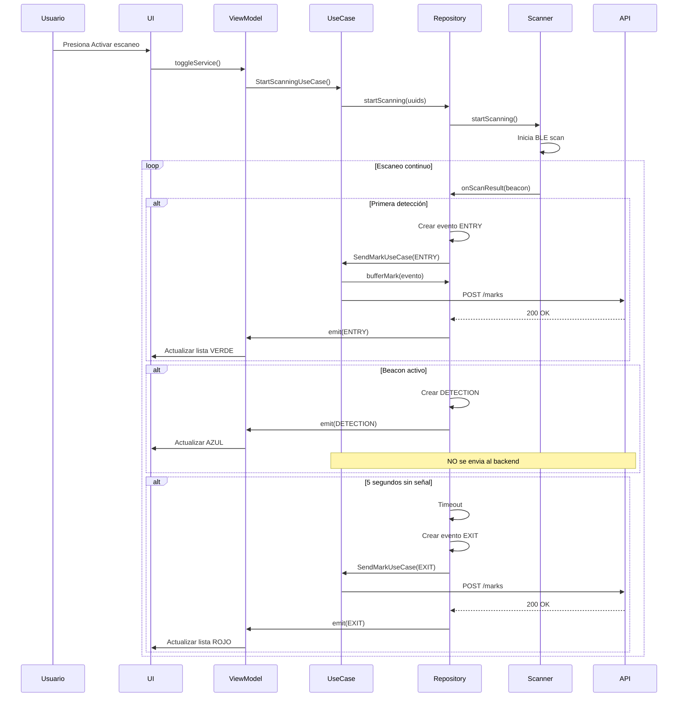
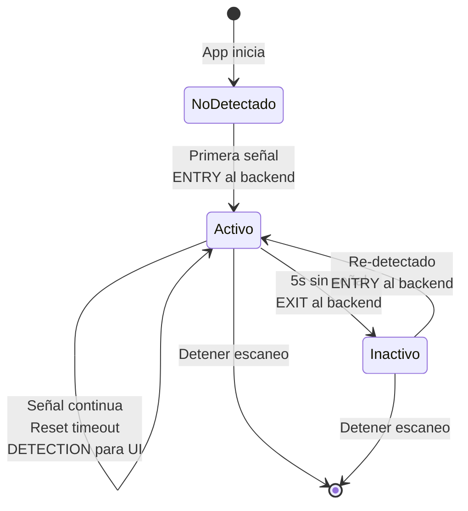
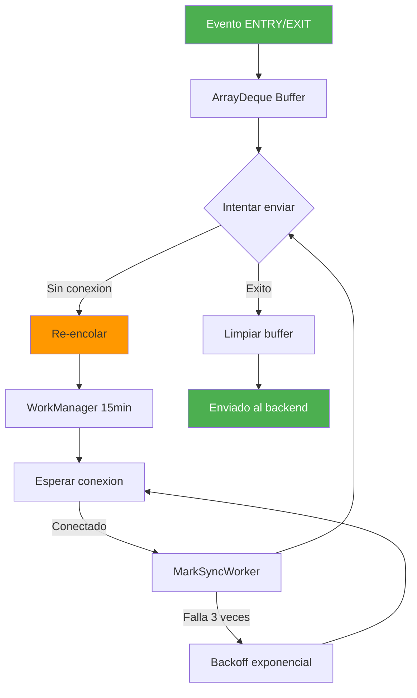
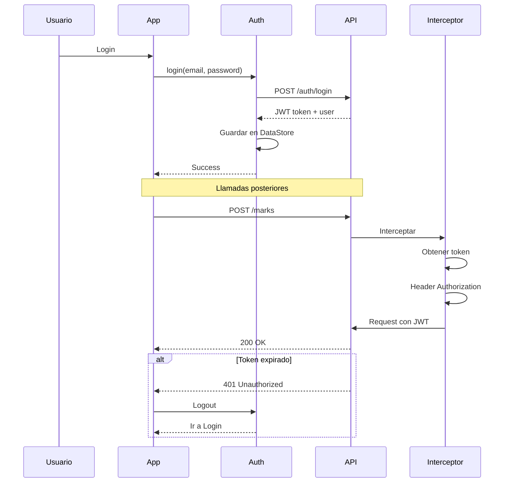
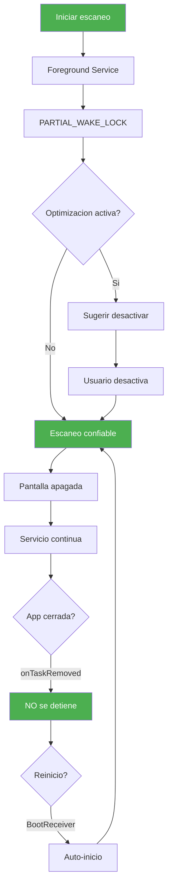
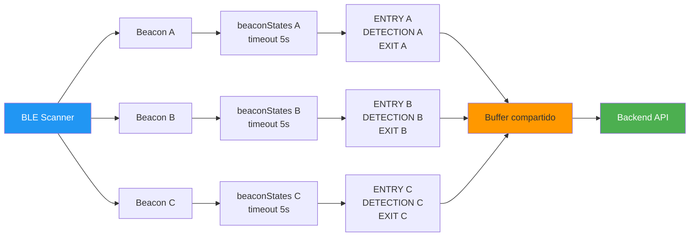

# ARQUITECTURA Y FLUJO DE AKISTOY MOBILE

## 1. DIAGRAMA DE FLUJO COMPLETO DEL SISTEMA

```mermaid
flowchart TB
    Start([Usuario abre app]) --> Auth{Autenticado?}

    Auth -->|No| Login[LoginScreen]
    Auth -->|Si| Home[HomeScreen]

    Login --> LoginAPI[POST /auth/login]
    LoginAPI --> SaveToken[Guardar JWT token]
    SaveToken --> Home

    Home --> StartBtn[Presiona Activar escaneo]
    StartBtn --> StartService[ServiceController.startService]
    StartService --> ForegroundSvc[BeaconForegroundService]
    ForegroundSvc --> WakeLock[Adquirir WakeLock]
    WakeLock --> FetchUUIDs[GetConfigUseCase]
    FetchUUIDs --> ConfigAPI[GET /config/uuids]
    ConfigAPI --> StartScanning[StartScanningUseCase]
    StartScanning --> BLEScanner[BeaconScanner LOW_LATENCY]

    BLEScanner --> ScanLoop{Escaneo continuo}

    ScanLoop -->|Beacon detectado| ParseResult[parseResult]
    ParseResult --> BeaconRepo[BeaconRepositoryImpl]

    BeaconRepo --> CheckState{Beacon activo?}

    CheckState -->|No| EntryEvent[Crear evento ENTRY]
    EntryEvent --> EmitEntry[Emitir ENTRY]
    EmitEntry --> StartTimeout[Iniciar timeout 5s]
    StartTimeout --> SaveState[Guardar en beaconStates]

    CheckState -->|Si| CheckDedup{Pasaron 3s?}
    CheckDedup -->|Si| DetectionEvent[Evento DETECTION]
    DetectionEvent --> EmitDetection[Emitir para UI]
    CheckDedup -->|No| SkipEvent[Ignorar]

    EmitDetection --> ResetTimeout[Reset timeout 5s]
    SkipEvent --> ResetTimeout
    ResetTimeout --> UpdateState[Actualizar lastSeen]
    UpdateState --> ScanLoop

    StartTimeout -->|5s sin señal| TimeoutExpired[Timeout expirado]
    TimeoutExpired --> ExitEvent[Crear evento EXIT]
    ExitEvent --> EmitExit[Emitir EXIT]
    EmitExit --> MarkInactive[Marcar inactivo]
    MarkInactive --> ScanLoop

    SaveState --> SendMark[SendMarkUseCase]
    EmitEntry --> SendMark
    EmitExit --> SendMark

    SendMark --> FilterType{Tipo evento?}
    FilterType -->|DETECTION| IgnoreSend[No enviar al backend]
    FilterType -->|ENTRY o EXIT| BufferMark[MarkRepository.bufferMark]

    BufferMark --> AddBuffer[Agregar a ArrayDeque]
    AddBuffer --> SendBuffered[sendBufferedMarks]

    SendBuffered --> CheckUser{Usuario auth?}
    CheckUser -->|No| FailSend[Error no autenticado]
    CheckUser -->|Si| GetBatch[Obtener batch]

    GetBatch --> BuildRequest[Crear BeaconMarkRequest]
    BuildRequest --> SendAPI[POST /marks]

    SendAPI --> APISuccess{Respuesta OK?}
    APISuccess -->|Si| SuccessComplete[Enviado exitosamente]
    APISuccess -->|No| RequeueAll[Re-encolar eventos]

    RequeueAll --> ScheduleWorker[MarkSyncWorker retry 15min]
    ScheduleWorker --> SendBuffered

    SuccessComplete --> UpdateUI[HomeViewModel actualiza UI]
    IgnoreSend --> UpdateUI
    UpdateUI --> HomeScreen[Mostrar en pantalla]
    HomeScreen --> ScanLoop

    HomeScreen --> StopBtn[Presiona Detener]
    StopBtn --> StopService[ServiceController.stopService]
    StopService --> CancelTimeouts[Cancelar timeouts]
    CancelTimeouts --> StopBLE[Detener BLE scan]
    StopBLE --> ReleaseWakeLock[Liberar WakeLock]
    ReleaseWakeLock --> End([Servicio detenido])

    style Start fill:#4CAF50
    style End fill:#F44336
    style EntryEvent fill:#4CAF50,color:#fff
    style ExitEvent fill:#F44336,color:#fff
    style DetectionEvent fill:#2196F3,color:#fff
    style SuccessComplete fill:#4CAF50,color:#fff
```



---

## 2. ARQUITECTURA DE CAPAS

```mermaid
flowchart LR
    subgraph UI[PRESENTACION]
        HomeScreen[HomeScreen.kt]
        SettingsScreen[SettingsScreen.kt]
        LoginScreen[LoginScreen.kt]
    end

    subgraph ViewModel[VIEWMODEL]
        HomeVM[HomeViewModel]
        SettingsVM[SettingsViewModel]
        SessionVM[SessionViewModel]
    end

    subgraph Domain[DOMINIO]
        UseCases[StartScanningUseCase<br/>StopScanningUseCase<br/>SendMarkUseCase]
        Models[BeaconEvent<br/>BeaconEventType]
    end

    subgraph Data[DATOS]
        Repos[BeaconRepositoryImpl<br/>MarkRepositoryImpl<br/>AuthRepositoryImpl]
        Scanner[BeaconScanner]
        API[AkistoyApi]
    end

    subgraph Service[SERVICIO]
        ForegroundSvc[BeaconForegroundService]
        Worker[MarkSyncWorker]
    end

    subgraph Hardware[HARDWARE]
        BLE[BluetoothLeScanner]
        Network[HTTP Client]
    end

    UI --> ViewModel
    ViewModel --> Domain
    Domain --> Data
    Data --> Service
    Service --> Hardware
    Data --> Hardware

    style UI fill:#E3F2FD
    style ViewModel fill:#BBDEFB
    style Domain fill:#90CAF9
    style Data fill:#64B5F6
    style Service fill:#42A5F5
    style Hardware fill:#2196F3,color:#fff
```



---

## 3. SECUENCIA DE DETECCION DE BEACON



---

## 4. ESTADOS DE UN BEACON



---

## 5. BUFFER Y REINTENTO DE EVENTOS



---

## 6. AUTENTICACION Y JWT



---

## 7. GESTION DE BATERIA Y BACKGROUND



---

## 8. FLUJO MULTI-BEACON



---

## PAYLOAD ENVIADO AL BACKEND

### Request: POST /marks
```json
{
  "device_id": "samsung_galaxy_a23_abc123",
  "user_id": "user_uuid_456",
  "beacon_id": "e2c56db5dffb48d2b060d0f5a71096e0",
  "rssi": -65,
  "ts_client": "2025-01-23T15:30:45.123Z",
  "event_type": "entry"
}
```

### event_type valores:
- **"entry"** - Usuario entró al rango del beacon
- **"exit"** - Usuario salió del rango (5s sin señal)
- **"detection"** - Detección continua (NO se envía al backend)

---

## PARAMETROS CONFIGURABLES

| Parámetro | Archivo | Línea | Valor | Propósito |
|-----------|---------|-------|-------|-----------|
| `SCAN_MODE` | BeaconScanner.kt | 62 | `LOW_LATENCY` | Detección <1s |
| `EXIT_TIMEOUT_SECONDS` | BeaconRepositoryImpl.kt | 145 | `5L` | Timeout para EXIT |
| `DEDUP_WINDOW_MS` | BeaconRepositoryImpl.kt | 144 | `3000L` | Deduplicación |
| `MAX_BUFFER_SIZE` | BeaconRepositoryImpl.kt | 143 | `50` | Eventos en memoria |
| `WORKER_INTERVAL` | MarkSyncWorker.kt | 37 | `15 min` | Reintento sync |

---

## CASOS DE USO

### Usuario entra a zona con 3 beacons

```
T=0s:   Detecta Beacon A, B, C
        → ENTRY A, B, C (enviados al backend)

T=3s:   Señal continua A, B, C
        → DETECTION A, B, C (solo UI, no backend)

T=10s:  Pierde señal de B
        → Timeout iniciado para B

T=15s:  Timeout B expirado
        → EXIT B (enviado al backend)

T=20s:  Re-detecta B
        → ENTRY B (enviado al backend)
```

### Sin conexión de red

```
T=0s:   ENTRY A → Buffer (sin conexión)
T=5s:   ENTRY B → Buffer (sin conexión)
T=10s:  EXIT A → Buffer (sin conexión)

        WorkManager espera conexión...

T=15m:  Conexión disponible
        → Enviar ENTRY A, ENTRY B, EXIT A
        → Buffer limpiado
```

---

## ENDPOINTS DEL BACKEND

| Método | Endpoint | Auth | Propósito |
|--------|----------|------|-----------|
| POST | `/auth/login` | No | Login usuario |
| POST | `/marks` | JWT | Enviar evento beacon |
| GET | `/config/uuids` | JWT | Obtener lista UUIDs |
| POST | `/config/uuids` | JWT | Actualizar UUIDs |

---

## DEBUG Y LOGS

Ver logs en tiempo real:
```bash
adb logcat | grep -E "RealBeaconScanner|BeaconRepository|MarkRepository"
```

Eventos importantes:
- `Scan started with X filters` - Escaneo iniciado
- `onScanResult: beaconId=...` - Beacon detectado
- `ENTRY event for beacon...` - Entrada registrada
- `EXIT event for beacon...` - Salida registrada
- `Sending mark to backend` - Enviando al API
- `Mark sent successfully` - Éxito

---

## COLORES DE EVENTOS EN UI

- 🟢 **VERDE** - ENTRY (entrada)
- 🔴 **ROJO** - EXIT (salida)
- 🔵 **AZUL** - DETECTION (detección continua)

---

Para visualizar estos diagramas, abre el archivo en:
- **GitHub** (renderiza Mermaid automáticamente)
- **VS Code** con extensión "Markdown Preview Mermaid Support"
- **Mermaid Live Editor**: https://mermaid.live/
