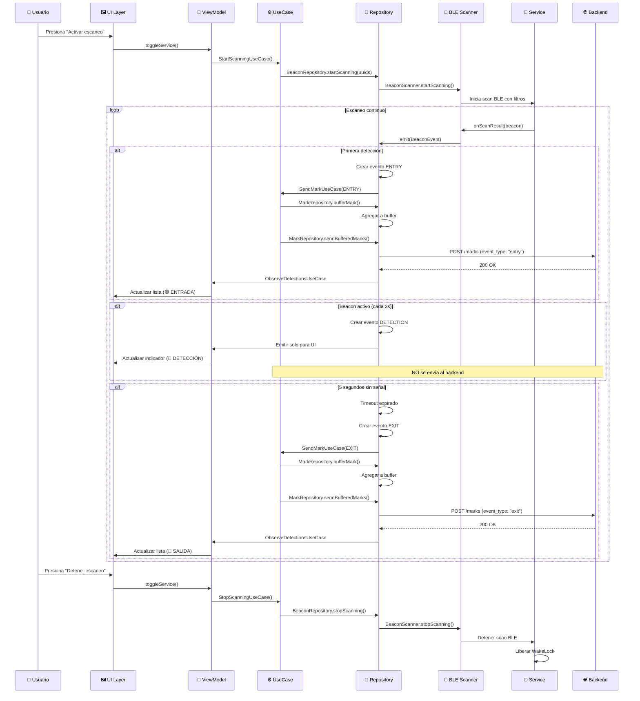
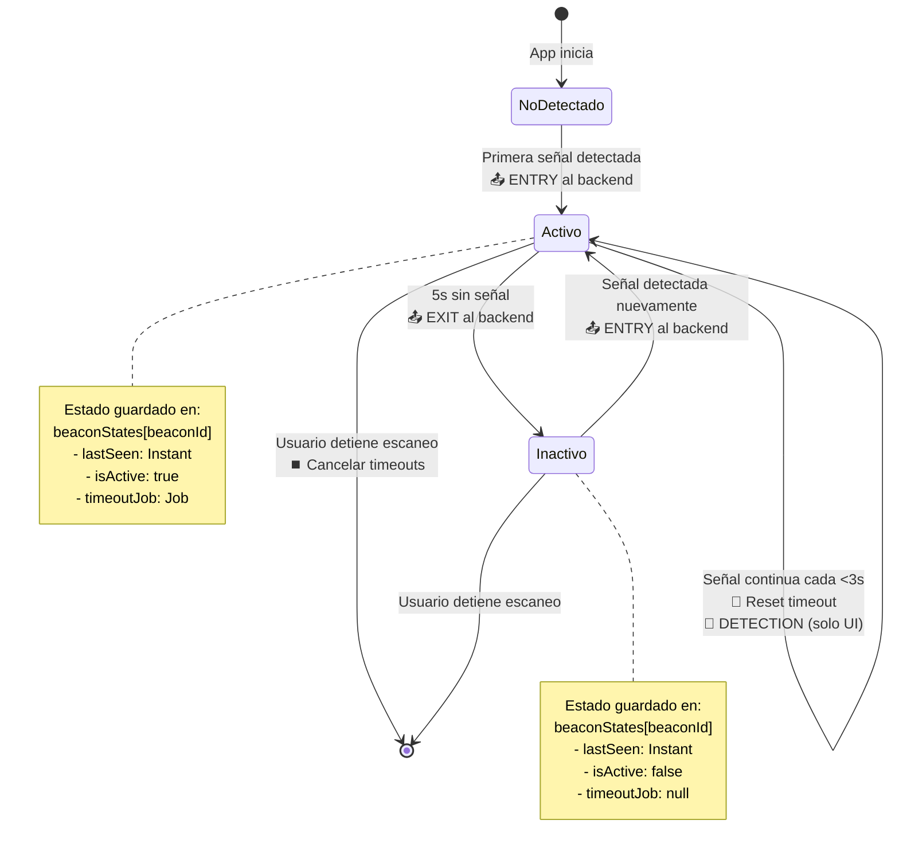
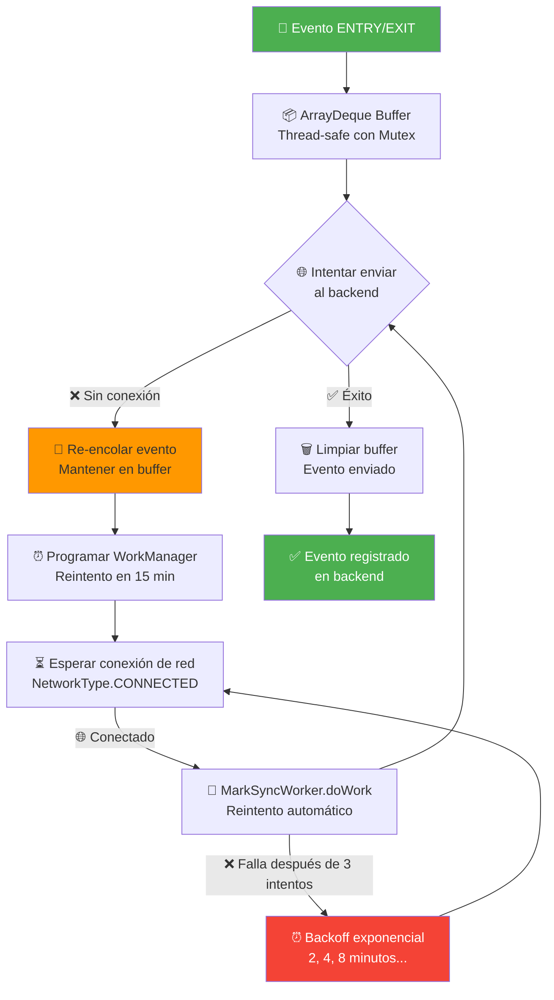
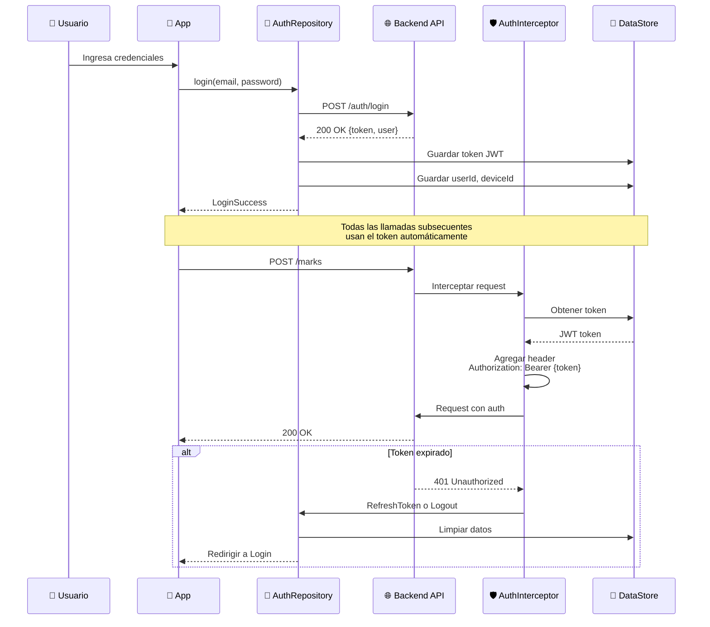
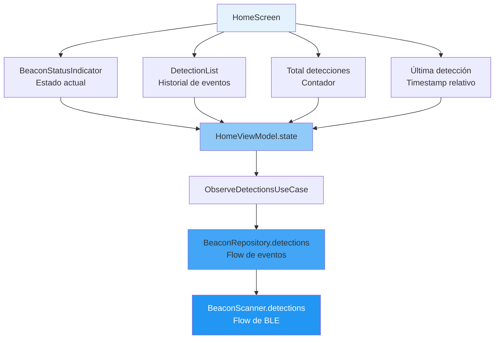
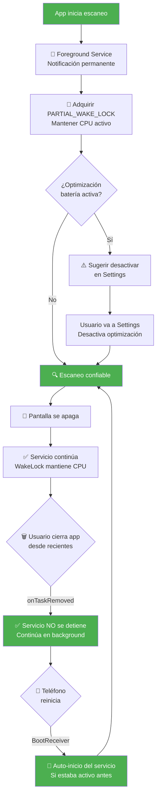

# 📊 ARQUITECTURA Y FLUJO DE AKISTOY MOBILE

## 🔄 DIAGRAMA DE FLUJO COMPLETO DEL SISTEMA

```mermaid
flowchart TB
    Start([👤 Usuario abre la app]) --> Auth{¿Autenticado?}

    Auth -->|No| Login[🔐 LoginScreen<br/>AuthRepository]
    Auth -->|Sí| Home[🏠 HomeScreen<br/>Mostrar dashboard]

    Login --> LoginAPI[📡 POST /auth/login<br/>Backend NestJS]
    LoginAPI --> SaveToken[💾 Guardar token JWT<br/>AuthInterceptor]
    SaveToken --> Home

    Home --> CheckPerms{¿Permisos<br/>Bluetooth/Location?}
    CheckPerms -->|No| RequestPerms[⚠️ Solicitar permisos<br/>MainActivity]
    RequestPerms --> Home

    CheckPerms -->|Sí| StartBtn[▶️ Usuario presiona<br/>'Activar escaneo']

    StartBtn --> StartService[🚀 ServiceController<br/>startService]
    StartService --> ForegroundSvc[📢 BeaconForegroundService<br/>Notificación permanente]

    ForegroundSvc --> AcquireWakeLock[🔋 Adquirir WakeLock<br/>Mantener CPU activo]
    AcquireWakeLock --> FetchUUIDs[📥 GetConfigUseCase<br/>Obtener UUIDs a monitorear]

    FetchUUIDs --> ConfigAPI[📡 GET /config/uuids<br/>Backend devuelve lista]
    ConfigAPI --> StartScanning[🔍 StartScanningUseCase<br/>Iniciar escaneo BLE]

    StartScanning --> BLEScanner[📡 BeaconScanner<br/>BluetoothLeScanner]

    BLEScanner --> ScanMode[⚙️ Configurar escaneo:<br/>• LOW_LATENCY<br/>• AGGRESSIVE<br/>• Filtros por UUID]

    ScanMode --> ScanLoop{🔁 Escaneo continuo<br/>en background}

    ScanLoop -->|Beacon detectado| ParseResult[🔬 parseResult<br/>Extraer beaconId, RSSI, proximity]
    ParseResult --> EmitRaw[📤 Emitir BeaconEvent<br/>tipo: DETECTION]

    EmitRaw --> BeaconRepo[🗄️ BeaconRepositoryImpl<br/>handleBeaconDetection]

    BeaconRepo --> CheckState{¿Beacon ya<br/>está activo?}

    CheckState -->|No, primera vez| EntryEvent[🟢 Crear evento ENTRY<br/>timestamp: ahora]
    EntryEvent --> EmitEntry[📤 Emitir evento ENTRY]
    EmitEntry --> StartTimeout[⏱️ Iniciar timeout 5s<br/>Job en coroutine]
    StartTimeout --> SaveState[💾 Guardar en beaconStates<br/>isActive: true]

    CheckState -->|Sí, ya activo| CheckDedup{¿Pasaron >3s<br/>desde última<br/>detección?}

    CheckDedup -->|Sí| DetectionEvent[🔵 Crear evento DETECTION<br/>Solo para UI]
    DetectionEvent --> EmitDetection[📤 Emitir DETECTION]

    CheckDedup -->|No| SkipEvent[⏭️ Ignorar<br/>deduplicación]

    EmitDetection --> ResetTimeout[🔄 Cancelar timeout anterior<br/>Crear nuevo timeout 5s]
    SkipEvent --> ResetTimeout
    ResetTimeout --> UpdateState[💾 Actualizar lastSeen<br/>en beaconStates]

    UpdateState --> ScanLoop

    StartTimeout -->|5s sin señal| TimeoutExpired[⏰ Timeout expirado]
    TimeoutExpired --> ExitEvent[🔴 Crear evento EXIT<br/>timestamp: ahora]
    ExitEvent --> EmitExit[📤 Emitir evento EXIT]
    EmitExit --> MarkInactive[💾 Marcar beacon<br/>isActive: false]
    MarkInactive --> ScanLoop

    SaveState --> SendMark[📨 SendMarkUseCase<br/>Procesar evento]
    EmitEntry --> SendMark
    EmitExit --> SendMark

    SendMark --> FilterType{¿Tipo de evento?}

    FilterType -->|DETECTION| IgnoreSend[⏭️ No enviar al backend<br/>Solo para UI]
    FilterType -->|ENTRY o EXIT| BufferMark[📦 MarkRepository<br/>bufferMark evento]

    BufferMark --> AddBuffer[➕ Agregar a ArrayDeque<br/>Thread-safe con Mutex]
    AddBuffer --> SendBuffered[📤 sendBufferedMarks<br/>Intentar enviar]

    SendBuffered --> CheckUser{¿Usuario<br/>autenticado?}
    CheckUser -->|No| FailSend[❌ Error:<br/>Usuario no autenticado]
    CheckUser -->|Sí| GetBatch[📋 Obtener batch de eventos<br/>Vaciar buffer temporalmente]

    GetBatch --> ForEachEvent[🔁 Para cada evento<br/>en el batch]

    ForEachEvent --> BuildRequest[📝 Crear BeaconMarkRequest:<br/>• device_id<br/>• user_id<br/>• beacon_id<br/>• rssi<br/>• timestamp<br/>• event_type]

    BuildRequest --> SendAPI[📡 POST /marks<br/>AkistoyApi.sendMark]

    SendAPI --> APISuccess{¿Respuesta<br/>exitosa?}

    APISuccess -->|Sí| NextEvent{¿Más eventos?}
    NextEvent -->|Sí| ForEachEvent
    NextEvent -->|No| SuccessComplete[✅ Todos enviados<br/>Buffer limpio]

    APISuccess -->|No, Error de red| RequeueAll[🔄 Re-encolar todos<br/>Volver al buffer]
    RequeueAll --> ScheduleWorker[⏰ MarkSyncWorker<br/>Reintento en 15 min]

    ScheduleWorker --> WorkerWait[⏳ WorkManager espera<br/>conexión de red]
    WorkerWait -->|Conectado| SendBuffered

    SuccessComplete --> UpdateUI[🖼️ HomeViewModel<br/>Actualizar UI]
    IgnoreSend --> UpdateUI

    UpdateUI --> HomeScreen[🏠 HomeScreen muestra:<br/>• Beacon activo (último)<br/>• Lista de eventos<br/>• Total detecciones<br/>• Estado Bluetooth]

    HomeScreen --> DetectionList[📜 DetectionList<br/>Muestra eventos con colores:<br/>🟢 ENTRADA<br/>🔴 SALIDA<br/>🔵 DETECCIÓN]

    DetectionList --> ScanLoop

    HomeScreen --> StopBtn[⏹️ Usuario presiona<br/>'Detener escaneo']
    StopBtn --> StopService[🛑 ServiceController<br/>stopService]

    StopService --> CancelTimeouts[❌ Cancelar todos timeouts<br/>Limpiar beaconStates]
    CancelTimeouts --> StopBLE[🔌 scanner.stopScanning<br/>Detener BLE]
    StopBLE --> ReleaseWakeLock[🔋 Liberar WakeLock]
    ReleaseWakeLock --> RemoveNotif[🔕 Remover notificación<br/>stopForeground]
    RemoveNotif --> End([🏁 Servicio detenido])

    style Start fill:#4CAF50
    style End fill:#F44336
    style EntryEvent fill:#4CAF50,color:#fff
    style ExitEvent fill:#F44336,color:#fff
    style DetectionEvent fill:#2196F3,color:#fff
    style SendAPI fill:#FF9800
    style SuccessComplete fill:#4CAF50,color:#fff
    style FailSend fill:#F44336,color:#fff
```

---

## 🏗️ ARQUITECTURA DE CAPAS

```mermaid
flowchart LR
    subgraph UI["🖼️ CAPA DE PRESENTACIÓN"]
        HomeScreen[HomeScreen.kt]
        SettingsScreen[SettingsScreen.kt]
        LoginScreen[LoginScreen.kt]
        Components[BeaconStatusIndicator<br/>DetectionList]
    end

    subgraph ViewModel["🧠 CAPA DE VIEWMODEL"]
        HomeVM[HomeViewModel]
        SettingsVM[SettingsViewModel]
        SessionVM[SessionViewModel]
    end

    subgraph Domain["⚙️ CAPA DE DOMINIO"]
        UseCases[StartScanningUseCase<br/>StopScanningUseCase<br/>SendMarkUseCase<br/>ObserveDetectionsUseCase<br/>LoginUseCase]
        Models[BeaconEvent<br/>BeaconEventType<br/>User]
    end

    subgraph Data["💾 CAPA DE DATOS"]
        Repos[BeaconRepositoryImpl<br/>MarkRepositoryImpl<br/>AuthRepositoryImpl<br/>ConfigRepositoryImpl]
        Scanner[BeaconScanner<br/>RealBeaconScanner]
        API[AkistoyApi<br/>AuthInterceptor]
    end

    subgraph Service["🚀 CAPA DE SERVICIO"]
        ForegroundSvc[BeaconForegroundService<br/>WakeLock Management]
        Worker[MarkSyncWorker<br/>Background Sync]
        Controller[ServiceController]
    end

    subgraph Hardware["📡 HARDWARE"]
        BLE[BluetoothLeScanner<br/>Android BLE Stack]
        Network[Network Layer<br/>HTTP Client]
    end

    UI --> ViewModel
    ViewModel --> Domain
    Domain --> Data
    Data --> Service
    Service --> Hardware
    Data --> Hardware

    style UI fill:#E3F2FD
    style ViewModel fill:#BBDEFB
    style Domain fill:#90CAF9
    style Data fill:#64B5F6
    style Service fill:#42A5F5
    style Hardware fill:#2196F3,color:#fff
```



---

## 🔄 CICLO DE VIDA DE UN EVENTO



---

## 🗺️ ESTADOS DE UN BEACON



---

## 📦 BUFFER Y REINTENTO DE EVENTOS



---

## 🔐 AUTENTICACIÓN Y SEGURIDAD



---

## 📊 ESTRUCTURA DE DATOS ENVIADOS AL BACKEND

### Request: POST /marks
```json
{
  "device_id": "samsung_galaxy_a23_abc123",
  "user_id": "user_uuid_456",
  "beacon_id": "e2c56db5dffb48d2b060d0f5a71096e0",
  "rssi": -65,
  "ts_client": "2025-01-23T15:30:45.123Z",
  "event_type": "entry"  // ✅ NUEVO: "entry" | "exit" | "detection"
}
```

### Response: 200 OK
```json
{
  "status": "ok"
}
```

---

## ⚙️ PARÁMETROS CONFIGURABLES

| Parámetro | Ubicación | Valor Actual | Propósito |
|-----------|-----------|--------------|-----------|
| `SCAN_MODE` | BeaconScanner.kt:62 | `LOW_LATENCY` | Latencia de detección <1s |
| `EXIT_TIMEOUT_SECONDS` | BeaconRepositoryImpl.kt:145 | `5L` | Tiempo sin señal = salida |
| `DEDUP_WINDOW_MS` | BeaconRepositoryImpl.kt:144 | `3_000L` | Filtrar detecciones repetidas |
| `MAX_BUFFER_SIZE` | BeaconRepositoryImpl.kt:143 | `50` | Eventos en memoria |
| `WORKER_INTERVAL` | MarkSyncWorker.kt:37 | `15 min` | Reintento de envío |
| `BACKOFF_DELAY` | MarkSyncWorker.kt:41 | `2 min` | Espera entre reintentos |

---

## 🎯 CASOS DE USO PRINCIPALES

### 1️⃣ Usuario entra a zona con 3 beacons
```
T=0s:  📡 Detecta Beacon-A, B, C
       └─> 🟢 ENTRY A, B, C (enviados al backend)

T=3s:  📡 Señal continua A, B, C
       └─> 🔵 DETECTION A, B, C (solo UI)

T=10s: 📡 Pierde señal de B
       └─> Timeout iniciado para B

T=15s: ⏰ Timeout B expirado
       └─> 🔴 EXIT B (enviado al backend)

T=20s: 📡 Re-detecta B
       └─> 🟢 ENTRY B (enviado al backend)
```

### 2️⃣ Sin conexión de red
```
T=0s:  🟢 ENTRY A → 📦 Buffer (sin conexión)
T=5s:  🟢 ENTRY B → 📦 Buffer (sin conexión)
T=10s: 🔴 EXIT A → 📦 Buffer (sin conexión)

⏰ MarkSyncWorker espera conexión...

T=15m: 🌐 Conexión disponible
       └─> 📤 Enviar ENTRY A, ENTRY B, EXIT A
       └─> ✅ Éxito, buffer limpiado
```

---

## 📱 COMPONENTES DE UI Y SU FUENTE DE DATOS



---

## 🔋 GESTIÓN DE BATERÍA Y BACKGROUND



---

## 🎨 LEYENDA DE COLORES Y SÍMBOLOS

| Símbolo | Significado |
|---------|-------------|
| 🟢 | Evento ENTRY (entrada) |
| 🔴 | Evento EXIT (salida) |
| 🔵 | Evento DETECTION (detección continua) |
| ✅ | Operación exitosa |
| ❌ | Error o fallo |
| 📡 | Comunicación BLE/API |
| 📦 | Buffer/almacenamiento |
| ⏰ | Timeout/timer |
| 🔄 | Retry/reintentar |
| 🔐 | Autenticación |
| 🔋 | Gestión de batería |

---

## 📞 ENDPOINTS DEL BACKEND

| Método | Endpoint | Propósito | Auth |
|--------|----------|-----------|------|
| POST | `/auth/login` | Autenticación usuario | No |
| POST | `/marks` | Enviar evento beacon | Sí (JWT) |
| GET | `/config/uuids` | Obtener lista de beacons | Sí (JWT) |
| POST | `/config/uuids` | Actualizar beacons monitoreados | Sí (JWT) |

---

## 🔍 DEBUG Y MONITOREO

Para ver logs en tiempo real:
```bash
adb logcat | grep -E "RealBeaconScanner|BeaconRepository|MarkRepository"
```

Eventos clave para monitorear:
- `Scan started with X filters` - Escaneo iniciado
- `onScanResult: beaconId=...` - Beacon detectado
- `ENTRY event for beacon...` - Entrada registrada
- `EXIT event for beacon...` - Salida registrada
- `Sending mark to backend` - Enviando al API
- `Mark sent successfully` - Éxito en envío

---

Esta documentación proporciona una visión completa del flujo del sistema. Puedes usar estos diagramas en tu documentación técnica o presentaciones.
